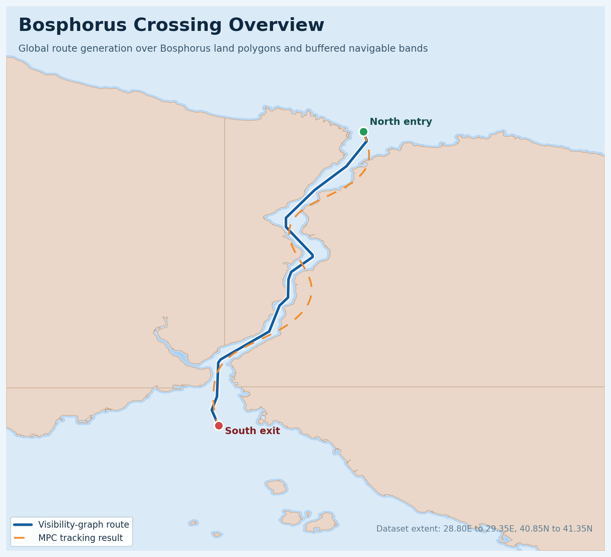

# BosphorusVGPathMPC

BosphorusVGPathMPC combines visibility-graph based global route planning for the Istanbul Strait with a C++/CasADi model predictive controller that tracks the generated path.



The project merges two working parts into a single pipeline:

- `VGPathPlanning` for global route generation over land polygons, mesh data, TSS data, and bathymetry constraints
- `RotaOptimaldsCpp` for dense waypoint tracking with a clothoid-based MPC controller

The straight-path reference tracking logic from the older `GlovbalPathPlanningVG` flow is reused here as uniform reference sampling in C++. A global route is sampled at a fixed distance step first, then converted into a dense local waypoint sequence for MPC tracking.

## Build

```bash
cmake -S . -B build -DCASADI_ROOT=/home/ferhannb/CALISMALAR/CasADi/casadi-3.6.7-linux64-matlab2018b
cmake --build build -j
```

## Run

Run only the global route planner:

```bash
./build/route_planner --config config/route_planner_bosphorus_mesh.ini
```

Run the full Bosphorus planning and tracking pipeline:

```bash
./build/bosphorus_vg_mpc \
  --route-config config/route_planner_bosphorus_mesh.ini \
  --mpc-scenario scenarios/bosphorus_tracking.ini
```

## Main Outputs

After a successful run, the main artifacts are written under `output/`:

- `bosphorus_route.csv`: georeferenced global route
- `bosphorus_reference.csv`: uniformly sampled local reference for MPC
- `bosphorus_mpc_log.csv`: receding-horizon MPC log
- `bosphorus_mpc_geo.csv`: georeferenced MPC trajectory
- `bosphorus_reference.svg`: global-route visualization
- `bosphorus_mpc.svg`: tracked-route visualization

Default reference settings:

- Uniform reference spacing: `0.10 km`
- Waypoint tolerance: `0.05 km`

## Project Notes

- `config/route_planner_bosphorus_mesh.ini` actively uses `mesh.land_geojson`. The lightweight mesh polygon is used to build the triangulation, while safety checks still run against the original land polygon.
- The Bosphorus mesh cache is stored inside the project and loaded by the default configuration. To rebuild it, set `use_cache = false` in the route planner config and run the planner again.
- `scripts/build_bosphorus_datasets.sh` can regenerate the Bosphorus datasets inside this repository.
- MPC tuning is controlled from `scenarios/bosphorus_tracking.ini`. The waypoint list in that file is only a placeholder and is overwritten automatically when `bosphorus_vg_mpc` builds the sampled reference.
