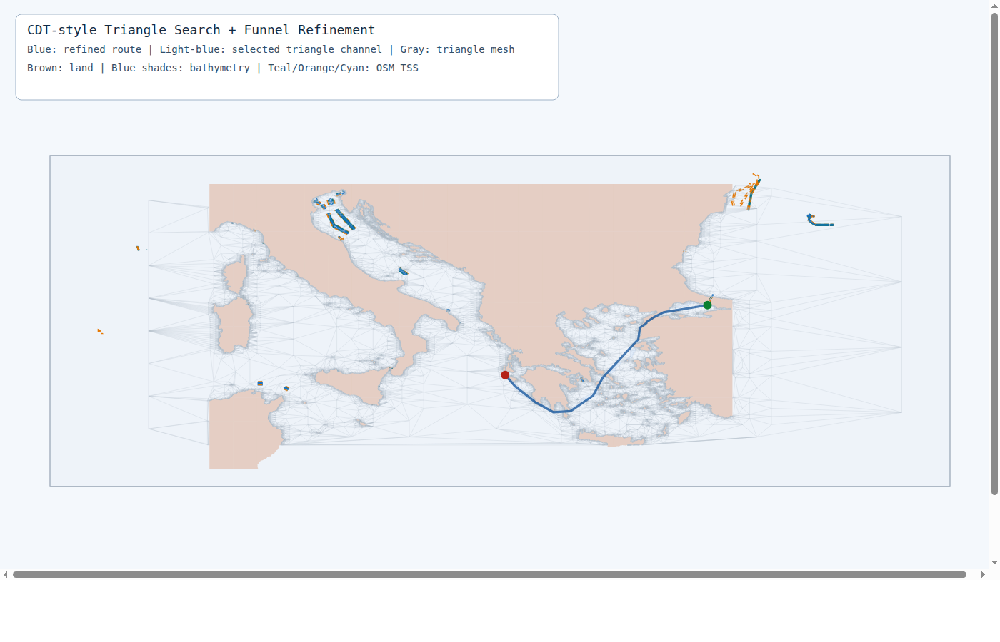
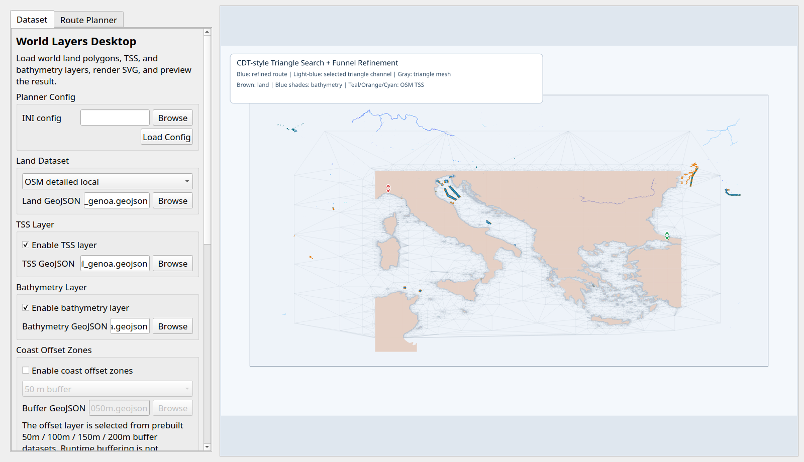

# VGPathPlanning

[](https://github.com/ferhannb/marine-route-planning/actions/workflows/build.yml)
[](LICENSE)
[](https://github.com/ferhannb/marine-route-planning/stargazers)

C++ marine route planning over GeoJSON coastlines, traffic separation schemes, and bathymetry constraints.
The project focuses on long-range sea routing with triangulation, triangle-channel search, and route refinement on real geographic data.



## Why This Project

VGPathPlanning is built for experimentation with:

- long-range marine routing on real coastlines,
- route constraints from land, TSS, and shallow-water regions,
- lightweight GIS-style workflows based on GeoJSON inputs,
- desktop and CLI exploration of path planning outputs.

The current repo is best suited for research prototypes, algorithm experiments, and visual debugging of maritime corridors such as Bosphorus, Marmara, and Istanbul-Genoa scenarios.

## Highlights

- C++17 codebase with CMake build
- GeoJSON-based land, TSS, and bathymetry inputs
- Triangle-channel route search with line-of-sight shortening
- SVG output for route and layer inspection
- Qt desktop UI for interactive layer configuration and viewport control
- Buffer and mesh dataset generation tools for coastal planning experiments

## Quickstart

### Ubuntu dependencies

```bash
sudo apt-get update
sudo apt-get install -y build-essential cmake qtbase5-dev libqt5svg5-dev
```

### Build

```bash
cmake -S . -B build -DCMAKE_BUILD_TYPE=Release
cmake --build build -j
```

### Download baseline coastline data

```bash
./scripts/download_coastline_data.sh
```

### Run the planner

```bash
./build/route_planner
```

Expected output:

- route summary in the terminal
- SVG output at `output/istanbul_genoa_route.svg`

## Main Executables

### `route_planner`

CLI planner for route generation and SVG export.

```bash
./build/route_planner \
  --dataset 10m \
  --bathymetry dataset/osm_bathymetry_istanbul_genoa.geojson \
  --min-depth-m 20 \
  --grid-step 0.5 \
  --corridor-lat 6 \
  --corridor-lon 8
```

Useful notes:

- `--dataset` accepts `10m`, `50m`, `110m`, or a direct `.geojson` path.
- `--mesh-land-dataset` can use a simplified land mesh for triangulation while collision checks still use `--dataset`.
- `--bathymetry` accepts GeoJSON `LineString`, `MultiLineString`, `Polygon`, or `MultiPolygon`.
- `--use-coastline-vertices` injects coastline samples into triangulation seed vertices.
- `--coastline-vertex-spacing-m` controls sampling interval on polygon edges.

`--min-depth-m` applies route constraints only to closed bathymetry polygons:

- polygons shallower than the threshold are treated as blocked areas,
- shallow areas are filtered from routing and mesh generation,
- open contour lines remain visualization-only.

### `world_layers_viewer`

Generates SVG previews from land, TSS, and bathymetry layers.

```bash
./build/world_layers_viewer --dataset 50m
./build/world_layers_viewer --dataset osm-local
./build/world_layers_viewer --dataset osm-world-detailed \
  --min-lat 34 --max-lat 45 \
  --min-lon 8.9 --max-lon 29.1
./build/world_layers_viewer --bathymetry dataset/gebco_2025_subset.asc \
  --min-lat 34 --max-lat 45 \
  --min-lon 8.9 --max-lon 29.1
./build/world_layers_viewer --no-tss --no-bathymetry
./build/world_layers_viewer \
  --min-lat 34 --max-lat 51 \
  --min-lon 0 --max-lon 35 \
  --svg output/istanbul_genoa_layers.svg
```

This executable:

- loads world land polygons such as `dataset/ne_10m_land.geojson`,
- adds default TSS and bathymetry layers shipped in the repo,
- generates an SVG preview such as `output/world_layers_overview.svg`.

### `world_layers_desktop`

Qt-based desktop UI for exploring inputs and generated SVG previews.

```bash
./build/world_layers_desktop
```

The desktop UI:

- lets you switch layer file paths,
- toggles TSS and bathymetry visibility,
- supports viewport bounds editing,
- renders SVG previews inside the application,
- prefers `gebco*.asc` files under `dataset/` when available.



### `buffered_land_dataset_builder`

Builds buffered coastlines and simplified mesh datasets.

Create 50 / 100 / 150 / 200 m coastal buffers:

```bash
./build/buffered_land_dataset_builder \
  --input dataset/osm_land_istanbul_genoa.geojson \
  --offsets-m 50,100,150,200 \
  --output-dir dataset/buffered \
  --band-output dataset/buffered/osm_land_istanbul_genoa_sea_bands.geojson
```

Create a lighter land mesh for triangulation:

```bash
./build/buffered_land_dataset_builder \
  --input dataset/osm_land_istanbul_genoa.geojson \
  --offset-m 200 \
  --mesh-output dataset/buffered/osm_land_istanbul_genoa_mesh_buffer_200m.geojson \
  --simplify-m 25 \
  --mesh-post-simplify-m 40 \
  --mesh-min-area-m2 25000 \
  --min-lat 39.6 --max-lat 42.2 --min-lon 25.0 --max-lon 30.6
```

Create a mesh dataset without buffering:

```bash
./build/buffered_land_dataset_builder \
  --input dataset/osm_land_istanbul_genoa.geojson \
  --offset-m 0 \
  --mesh-output dataset/mesh/land_mesh.geojson \
  --simplify-m 75 \
  --mesh-post-simplify-m 125 \
  --mesh-min-area-m2 250000 \
  --min-lat 34.0 --max-lat 51.0 --min-lon 0.0 --max-lon 35.0
```

## Algorithm Summary

1. Generate a candidate sea mesh from corridor points.
2. Build a Delaunay triangulation on those points.
3. Remove triangles that intersect land or constrained regions.
4. Search the triangle adjacency graph from start to goal.
5. Refine the resulting channel with sea line-of-sight shortening.

## Data Notes

Baseline coastline download:

```bash
./scripts/download_coastline_data.sh
```

This downloads:

- `dataset/ne_110m_land.geojson`
- `dataset/ne_50m_land.geojson`
- `dataset/ne_10m_land.geojson`

Default planner dataset:

- `ne_10m_land.geojson`

OSM-based land polygon experiment:

```bash
python3 -m pip install pyshp
./scripts/download_osm_land_geojson.sh
./build/route_planner --config config/route_planner_izmir_venedik_osm_land.ini
```

Bathymetry download:

```bash
./scripts/download_bathymetry_osm.sh
```

Typical bathymetry usage:

```bash
./build/route_planner \
  --config config/route_planner_marmara_straits_mesh.ini \
  --bathymetry dataset/osm_bathymetry_istanbul_genoa.geojson \
  --min-depth-m 20
```

The repo currently includes both sample and research-oriented datasets. For long-term GitHub hygiene, large generated datasets should eventually move to Releases, external storage, or Git LFS while keeping a compact reproducible sample in the repo.

## Project Status

Current strengths:

- real-world GeoJSON workflows
- working CLI and desktop tooling
- reproducible dataset generation scripts
- visible outputs that are easy to share

Current gaps:

- no automated test suite yet
- large tracked datasets make cloning heavier than necessary
- repo structure still contains staging material that should likely be separated

See [ROADMAP.md](ROADMAP.md) for cleanup and growth priorities.

## Contributing

Contributions are welcome. Start with [CONTRIBUTING.md](CONTRIBUTING.md) for setup and contribution expectations.

Good first contribution areas:

- build and CI improvements,
- dataset packaging cleanup,
- reproducible benchmarks,
- documentation and quickstart improvements,
- algorithm validation on new maritime corridors.

## License

This project is licensed under the terms of the [MIT License](LICENSE).
