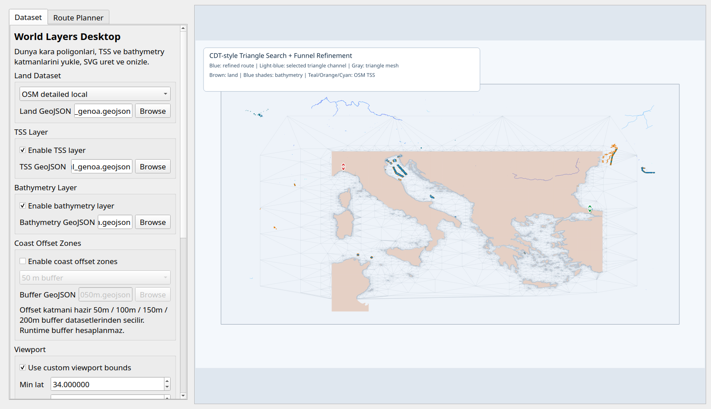

# VGPathPlanning

A C++ experimental application for long-range marine routing (3000-5000 km+).
The code loads world land polygons from GeoJSON and computes sea routes using triangulation plus triangle-channel search.


## Setup and Run

1. Download the dataset:

```bash
./scripts/download_coastline_data.sh
```

2. Build:

```bash
cmake -S . -B build
cmake --build build -j
```

3. Run:

```bash
./build/route_planner
```

First version of the layer viewer:

```bash
./build/world_layers_viewer
```

Desktop UI:

```bash
./build/world_layers_desktop
```



This executable:
- loads world land polygons (`dataset/ne_10m_land.geojson`),
- adds the default TSS and bathymetry GeoJSON layers shipped in the repo,
- generates a single SVG preview file: `output/world_layers_overview.svg`

Qt-based desktop UI:
- lets you change layer file paths,
- lets you enable or disable TSS and bathymetry layers,
- allows setting viewport bounds,
- generates SVG output and previews it inside the window,
- automatically prefers `gebco*.asc` files under `dataset/` for bathymetry if present.

Examples:

```bash
./build/world_layers_viewer --dataset 50m
./build/world_layers_viewer --dataset osm-local
./build/world_layers_viewer --dataset osm-world-detailed \
  --min-lat 34 --max-lat 45 \
  --min-lon 8.9 --max-lon 29.1
./build/world_layers_viewer --bathymetry dataset/gebco_2025_subset.asc \
  --min-lat 34 --max-lat 45 \
  --min-lon 8.9 --max-lon 29.1
./build/world_layers_viewer --no-tss --no-bathymetry
./build/world_layers_viewer \
  --min-lat 34 --max-lat 51 \
  --min-lon 0 --max-lon 35 \
  --svg output/istanbul_genoa_layers.svg
```

Notes:
- The land dataset included in the repo is global.
- The default TSS and bathymetry files currently included in the repo belong to the Istanbul-Genoa corridor.
- `dataset/osm_land_istanbul_genoa.geojson` provides a more detailed coastline boundary, and the desktop app uses it as the default option when available.
- The `osm-world-detailed` alias uses the OSM world land polygon shapefile source (`land_polygons.shp`).
- GEBCO `Esri ASCII raster (.asc)` subsets are supported for bathymetry; raster cells are converted into polygons inside the application using block-based aggregation.
- When new global TSS or bathymetry GeoJSON files are available, the same executable can use them through `--tss` and `--bathymetry`.

Optional parameters:

```bash
./build/route_planner \
  --dataset 10m \
  --bathymetry dataset/my_bathymetry.geojson \
  --min-depth-m 20 \
  --grid-step 0.5 \
  --corridor-lat 6 \
  --corridor-lon 8
```

`--dataset` can be `10m`, `50m`, `110m`, or a direct `.geojson` file path.
`--mesh-land-dataset` uses a separate simplified land dataset for triangulation; collision checks still use `--dataset`.
`--bathymetry` accepts GeoJSON `LineString`, `MultiLineString`, `Polygon`, or `MultiPolygon`.
Depth values are read from the `depth_m`, `depth`, `min_depth_m`, `max_depth_m`, `depth_min_m`, `depth_max_m`, or `elevation`
property fields. Negative values are normalized as depth in meters using `abs(...)`.
`--use-coastline-vertices` adds the outer boundary of the land polygon to the mesh as triangulation seed vertices.
`--coastline-vertex-spacing-m` defines the sampling interval of those seeds along the polygon edges.

`--min-depth-m` only applies route constraints for closed bathymetry polygons:
- if a bathymetry polygon depth is smaller than this threshold, the area is considered shallow,
- these areas are excluded like land in route, mesh vertex, and triangle filtering,
- open contour or isobath lines are only visualized on the SVG output.

At the end of execution:
- route information is printed to the terminal,
- a plot SVG file is generated at `output/istanbul_genoa_route.svg`.

## Algorithm Summary

1. A mesh candidate is generated from sea points.
2. Delaunay triangulation is built over those points.
3. Triangles overlapping land are removed and a triangle adjacency graph is created.
4. A triangle-sequence search is performed between the start and target.
5. The resulting channel is refined with sea line-of-sight shortening.

## Data

The script downloads these files:
- `dataset/ne_110m_land.geojson`
- `dataset/ne_50m_land.geojson`
- `dataset/ne_10m_land.geojson`

By default, the algorithm uses `ne_10m_land.geojson`.

For an OSM-based (more detailed) land polygon experiment:

```bash
python3 -m pip install pyshp
./scripts/download_osm_land_geojson.sh
./build/route_planner --config config/route_planner_izmir_venedik_osm_land.ini
```

To generate 50 / 100 / 150 / 200 m coastal buffer layers from shore toward sea:

```bash
./build/buffered_land_dataset_builder \
  --input dataset/osm_land_istanbul_genoa.geojson \
  --offsets-m 50,100,150,200 \
  --output-dir dataset/buffered \
  --band-output dataset/buffered/osm_land_istanbul_genoa_sea_bands.geojson
```

This command generates two types of data:
- files like `dataset/buffered/osm_land_istanbul_genoa_buffer_050m.geojson`: cumulatively buffered polygons extending land toward sea. These can be used directly as `land_geojson` in route constraints.
- `osm_land_istanbul_genoa_sea_bands.geojson`: writes `0-50`, `50-100`, `100-150`, `150-200 m` sea zones into a single GeoJSON. Each feature carries `inner_m` and `outer_m` properties.

To generate a lighter `mesh land` dataset for triangulation:

```bash
./build/buffered_land_dataset_builder \
  --input dataset/osm_land_istanbul_genoa.geojson \
  --offset-m 200 \
  --mesh-output dataset/buffered/osm_land_istanbul_genoa_mesh_buffer_200m.geojson \
  --simplify-m 25 \
  --mesh-post-simplify-m 40 \
  --mesh-min-area-m2 25000 \
  --min-lat 39.6 --max-lat 42.2 --min-lon 25.0 --max-lon 30.6
```

This mode:
- simplifies buffered polygons again for triangulation,
- removes inner holes,
- can filter very small polygons,
- writes the result as a GeoJSON that can be passed into `route_planner` as `land_geojson`.

To generate a mesh dataset without buffering, using only Douglas-Peucker simplification:

```bash
./build/buffered_land_dataset_builder \
  --input dataset/osm_land_istanbul_genoa.geojson \
  --offset-m 0 \
  --mesh-output dataset/mesh/land_mesh.geojson \
  --simplify-m 75 \
  --mesh-post-simplify-m 125 \
  --mesh-min-area-m2 250000 \
  --min-lat 34.0 --max-lat 51.0 --min-lon 0.0 --max-lon 35.0
```

Notes:
- Buffer geometry is generated with a true buffer; since the offsets are small, a polygon-based local projection is sufficient.
- If `--simplify-m` is not provided, the builder applies automatic simplification based on the offset. This produces more stable and lighter zones instead of following the coastline exactly.
- For large world datasets, it is more practical to provide corridor bounds with `--min-lat --max-lat --min-lon --max-lon`.
- With `--mesh-land-dataset`, this simplified dataset can be used only for triangulation while keeping the full land polygon for safety checks.

Bathymetry note:
- There is an OSM/Overpass-based bathymetry downloader:

```bash
./scripts/download_bathymetry_osm.sh
```

- Default output: `dataset/osm_bathymetry_istanbul_genoa.geojson`
- It can then be connected through config or CLI:

```bash
./build/route_planner \
  --config config/route_planner_marmara_straits_mesh.ini \
  --bathymetry dataset/osm_bathymetry_istanbul_genoa.geojson \
  --min-depth-m 20
```

For a triangulation experiment without buffering, directly with the coastline polygon:

```bash
./build/route_planner --config config/route_planner_marmara_straits_coastline_polygon.ini
```
